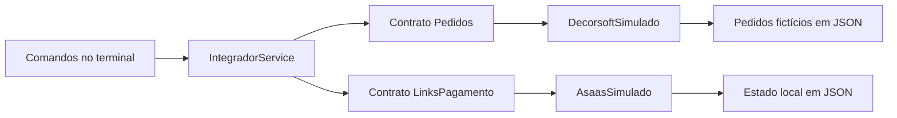

# Integração Decorsoft → Asaas · Demo

**Do pedido aprovado ao link de pagamento: uma demonstração em PHP, com dados fictícios e execução inteiramente local.**

Este projeto demonstra a lógica de uma integração entre um ERP e um serviço de pagamentos: consultar um pedido, validar suas condições, gerar um link e excluí-lo. Foi preparado como versão de portfólio de um caso de automação de faturamento.

> **Modo demonstrativo:** não acessa Decorsoft ou Asaas, não requer credenciais e não gera cobranças reais. Os nomes identificam os sistemas que inspiraram o fluxo; este projeto não é um SDK oficial nem implica vínculo com essas empresas.

## O problema

Transferir manualmente o valor de um pedido para uma ferramenta de cobrança exige trabalho repetitivo e abre espaço para erros. A proposta é conectar essas etapas por meio de um serviço que valida o pedido antes de solicitar um link de pagamento.

Esta versão permite estudar e executar esse fluxo sem utilizar informações de clientes ou contas de produção.

## Execute em um minuto

Requisito: **PHP 8.2 ou superior**, disponível no terminal. Não são necessários banco de dados, conta externa, arquivo `.env` ou instalação de dependências.

Na pasta deste projeto:

```bash
php bin/console.php demo
```

O comando consulta o pedido fictício `1001`, gera um link ilustrativo, repete a solicitação para demonstrar a prevenção de duplicidade e exclui o link. Usa um arquivo temporário próprio, removido ao terminar, sem alterar os links criados pelos outros comandos.

Trecho ilustrativo da saída — o identificador muda a cada execução:

```text
[DEMO LOCAL] Dados fictícios. Nenhuma cobrança real.

2. Gerando link fictício
{
    "id": "demo_a1b2c3d4e5f6",
    "url": "https://pagamentos.example.com/demo_a1b2c3d4e5f6",
    "pedido": 1001,
    "valorCentavos": 249990,
    "parcelas": 3,
    "status": "ATIVO"
}

3. Repetindo a solicitação sem duplicar o link
{
    "mesmoLink": true
}
```

Os endereços em `example.com` são ilustrativos e não permitem pagamentos. O valor `249990` representa **R$ 2.499,90**.

## Comandos disponíveis

```bash
php bin/console.php ajuda
php bin/console.php listar
php bin/console.php ver 1001
php bin/console.php gerar 1001 6
php bin/console.php excluir demo_a1b2c3d4e5f6
```

Para excluir, substitua o ID do exemplo pelo retornado ao gerar seu link.

Os comandos `gerar` e `excluir` persistem o estado em `var/links.json`, ignorado pelo Git. É necessário ter permissão de escrita em `var/`. Esse arquivo contém somente os registros fictícios criados localmente. Para reiniciar a simulação, ele pode ser removido com o programa fechado.

| Pedido fictício | Situação | Valor | Comportamento |
| --- | --- | --- | --- |
| 1001 | Aprovado | R$ 2.499,90 | Permite gerar link |
| 1002 | Aprovado | R$ 875,50 | Permite gerar link |
| 1003 | Orçamento | R$ 1.200,00 | Rejeita geração |
| 1004 | Cancelado | R$ 650,00 | Rejeita geração |

Por exemplo, `php bin/console.php gerar 1003` demonstra a rejeição de um pedido não aprovado. Erros encerram o comando com código de saída `1`.

## Regras implementadas

- Apenas pedidos existentes e aprovados, com valor positivo, podem gerar links.
- Valores são representados em centavos inteiros para preservar a precisão monetária.
- O limite desta demonstração é de 1 a 12 parcelas, com padrão de 3. Essa é uma regra local, não uma afirmação sobre limites da API real.
- Repetir a solicitação com o mesmo pedido, valor e parcelamento reutiliza o link ativo.
- Alterar condições de um pedido com link ativo exige excluir o link anterior.
- A exclusão marca o link como excluído; uma nova geração cria outro identificador.

## Arquitetura



O serviço depende de interfaces, permitindo substituir a origem de pedidos e o destino dos links sem alterar as regras de negócio. Os adaptadores desta versão são simuladores locais; seus campos são um modelo interno simplificado, não uma reprodução completa das respostas das APIs.

```text
bin/console.php               Entrada dos comandos
src/IntegradorService.php     Orquestração e regras de negócio
src/Contracts/                Interfaces de pedidos e pagamentos
src/Adapters/                 Implementações simuladas
data/pedidos.json             Dados exclusivamente fictícios
tests/run.php                 Testes automatizados e isolados
var/                         Estado local, não versionado
```

**Tecnologias:** PHP 8.2+, interfaces, injeção de dependências, JSON e GitHub Actions. O Composer é opcional e oferece os atalhos `composer demo` e `composer test`. Esta versão não precisa de cliente HTTP nem biblioteca de variáveis de ambiente, pois não faz chamadas externas.

## Testes

```bash
php tests/run.php
```

A suíte usa um runner simples em PHP, sem PHPUnit ou dependências externas. Cada teste tem armazenamento temporário isolado. São verificados valores, parcelamento, pedidos inválidos, prevenção de duplicidade, persistência entre instâncias, exclusão, regeneração de links e rejeição de arquivos inválidos. Uma falha retorna código de saída `1`.

O workflow incluído está configurado para verificar sintaxe, testes e a demonstração em PHP 8.2 e 8.4 no GitHub Actions, após a publicação.

## Escopo e limitações

Esta versão implementa **uma simulação local do fluxo de pedidos e links**. Não inclui integração HTTP, pagamentos, emissão de boletos/Pix, webhooks, sincronização de situação financeira, autenticação de usuários ou interface web. O armazenamento em JSON serve à demonstração; não é uma solução de persistência de produção nem garante recuperação após interrupção durante uma escrita.

Uma evolução possível seria implementar adaptadores HTTP com testes de contrato em ambiente de homologação. Essa etapa não está implementada. A demonstração não carrega `.env` nem oferece uma opção para acessar produção.
